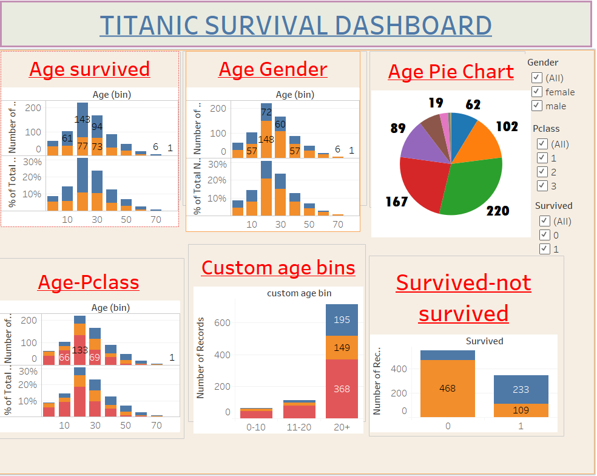

# Titanic-Data-Analysis-Tableau
Titanic Passenger Survival Analysis Dashboard using Tableau

# Titanic Data Analysis – Tableau

## Project Overview
This project explores the Titanic passenger dataset using Tableau to analyze passenger survival patterns and related factors.

## Dashboard Preview

## Tools Used
- Tableau
- Titanic Dataset

## Project File
- `Titanic-Analysis.twbx` – Packaged Tableau workbook

## Key Analysis
- Passenger survival analysis
- Passenger demographics
- Survival patterns across available dataset categories
